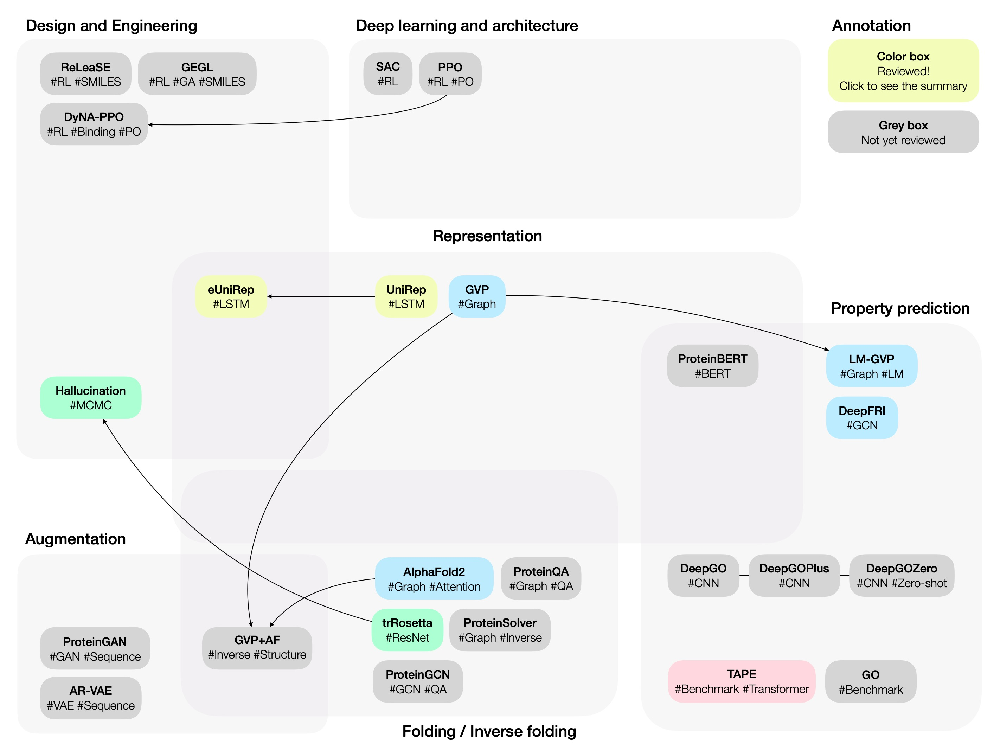

# Protein papers
> Papers and summaries regarding protein design, representation, and engineering

- Click block to see details
- Colored blocks denote papers with summary provided
- Gray blocks denote papers without summary
- Arrows denote relationships; same author or share architectures
### Topics covered
- Protein representation
- Protein property prediction
- Protein folding and inverse folding
- Protein design
- Protein engineering
- Deep learning, reinforcement learning, and data augmentation techniques that can be applied to protein understanding tasks
- (TBU) Antibody design
- (TBU) Protein-protein interaction
